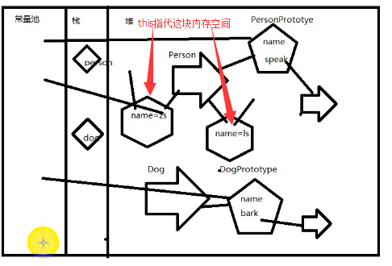
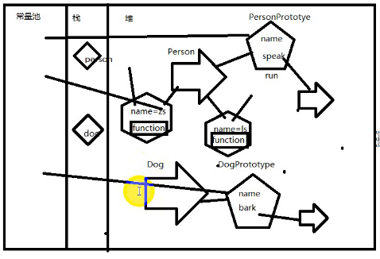

**回顾：**

**1.object对象**

- new关键字代表的是新开辟一块内存空间
- 没有被引用的内存空间，会在适当的时候被销毁

    - 两句代码含义等同

    `var person = new Object();`
    `var person = {};`

    - 访问对象的属性除了用 对象引用`.属性key`以外，还可以使用对象引用`[属性key]`

**2.面向对象的程序设计**

- a.`function`构造器

    - 共同点:

        - 动态创建一块内存空间，闭包

    - 不同点：

        - 函数调用是没有办法拿到空间的地址的，而且这块地址是一块临时地址，执行完函数之后，就会销毁

        - new开辟内存空间，把这块空间的地址返回，这块空间就有可能长期的被引用

- b.`prototype`原型

    - 通过原型使通过同样一个构造器所new（创建）出来的对象具有相同的属性和行为
    - `prototype`本质就是一个对象

- c.`foreach`

- c.`this`

- d.继承

---

**知识点：**

**1.prototype内存解析**

- `prototype`是原型，是一块所有对应构造器创建的对象都共享的内存空间
- 在面向对象设计程序的时候，属性应该是对应的空间的，而功能应该是`prototype`公共空间的

**2.通过prototype扩展功能**

- 所有的构造器都是继承于`Object`构造器的，因此只要`Object`的原型里有的功能，所有的对象都有

**3.封装**(面向对象程序设计过程)

- 1：找对象  小头爸爸  大头儿子  饭
- 2：抽象（类，构造器）
- 3：创建对象并且建立关系（操作对象）

**4.继承**

**5.面向对象程序设计案例（猜拳）**

**作业：**

- 用面向对象的思维设计十个生活中的场景案例

---

